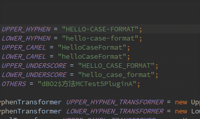
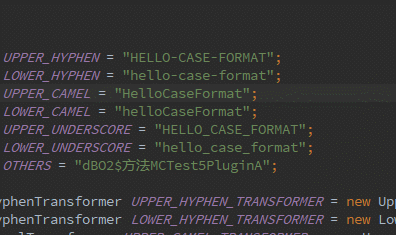
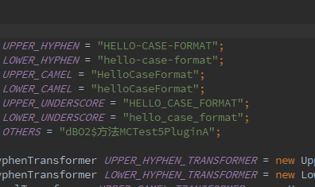
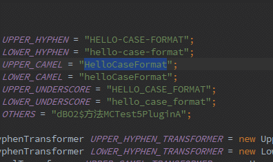
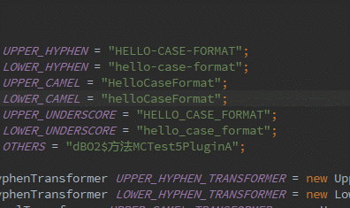

# CaseFormat
Converting selected text(or one word after pointer) between various ASCII case formats, such as hyphen, camel and underscore.

## Environment
- `Java8`
- `Win 10`
- `IDEAIntelliJ IDEA 2017.2.7`

## Plugin Jar
[case-format.jar](caseformat.jar)

## Keyboard Shortcut
- `ALT + H`: Converting selected text to lower hyphen case.
- `ALT + SHIFT + H`: Converting selected text to upper hyphen case.
- `ALT + C`: Converting selected text to lower camel case.
- `ALT + SHIFT + C`: Converting selected text to upper camel case.
- `ALT + U`: Converting selected text to lower underscore case.
- `ALT + SHIFT + U`: Converting selected text to upper underscore case.

## Example
lower hyphen

upper hyphen

lower camel

upper camel

lower underscore

upper underscore

